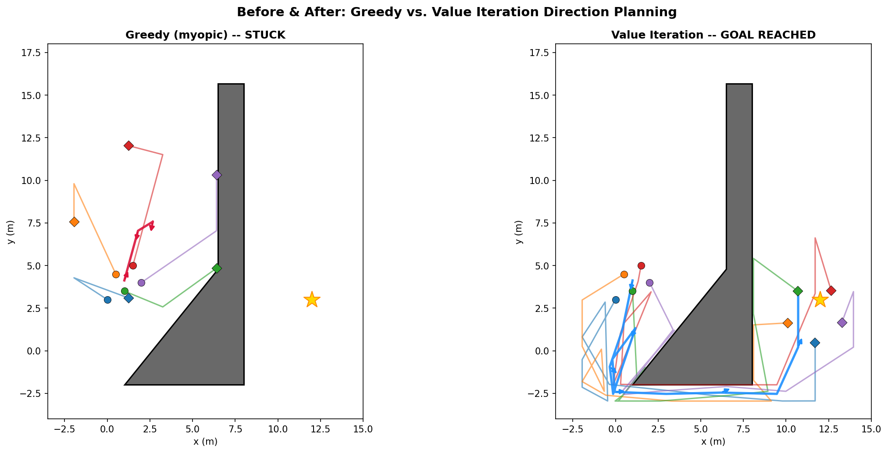
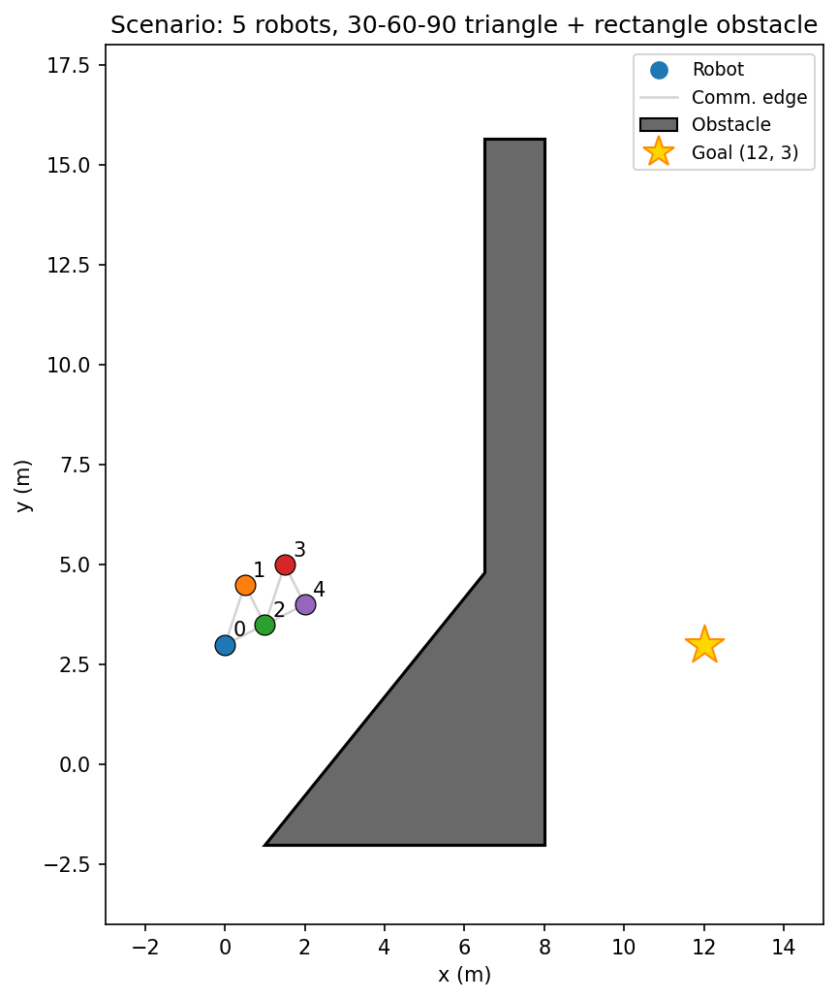
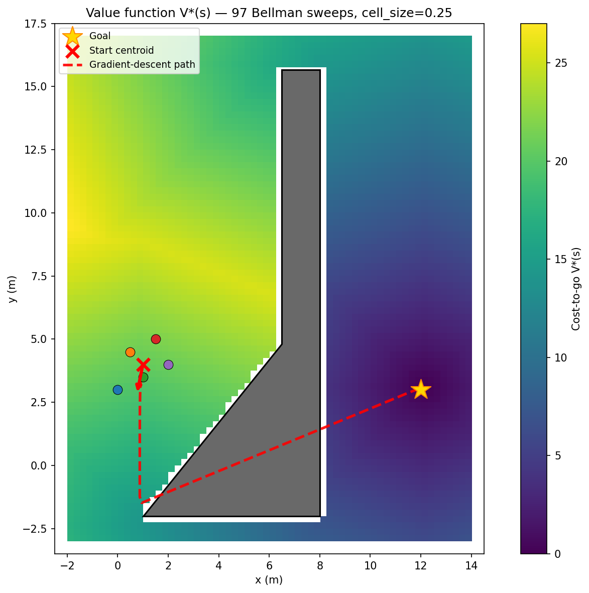
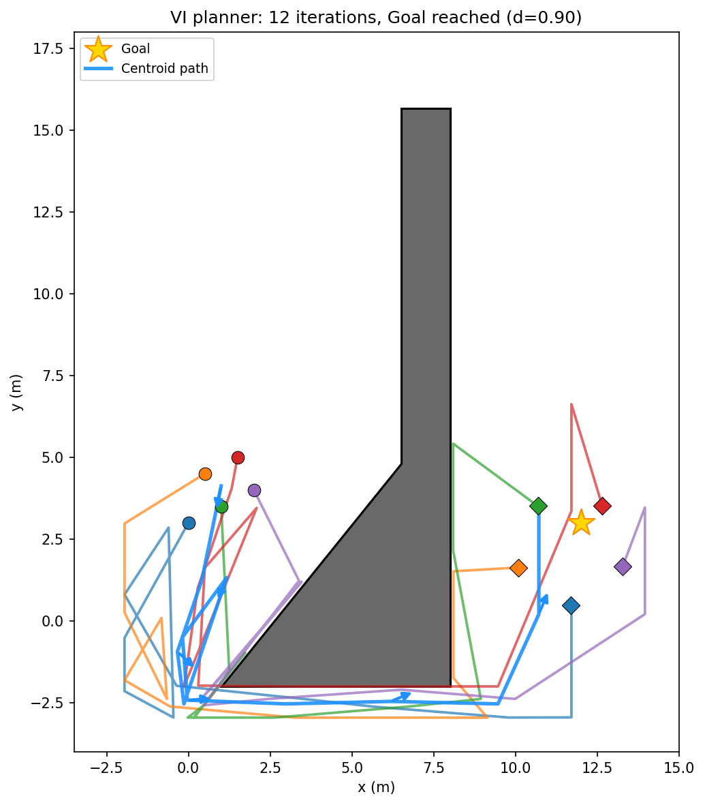
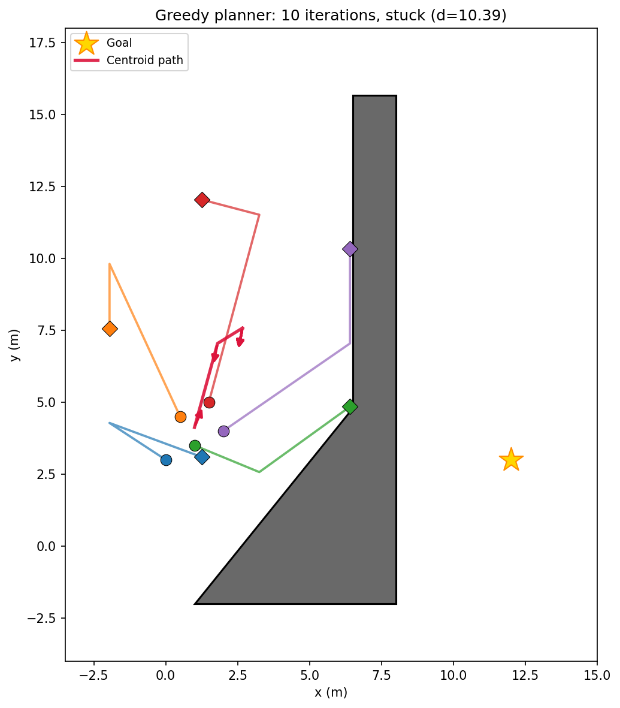

# Distributed Formation Control with Value Iteration Path Planning

A distributed multi-robot formation control system based on [Alonso-Mora et al. (2019)](https://ieeexplore.ieee.org/document/8768044), augmented with **Value Iteration on a Grid MDP** from [Kochenderfer, Wheeler & Wray, *Algorithms for Decision Making* (MIT Press, 2022), Chapter 7](https://algorithmsbook.com/) to replace the myopic direction-selection step.



**Left**: The greedy (myopic) planner gets stuck — it picks the direction with the best one-step clearance, which points away from the goal when a large obstacle blocks the direct path. **Right**: The VI planner computes globally optimal cost-to-go and routes the swarm around the obstacle bottom.

---

## The Problem

Five robots in pentagon formation must navigate from ~(1, 4) to a goal at (12, 3). A merged 30-60-90 triangle + rectangle obstacle blocks the direct path.



The original **greedy direction consensus** (Alg. 2 of Alonso-Mora et al.) selects the preferred direction by maximizing a one-step utility that combines ray clearance and goal alignment. This is **myopic** — it cannot plan multi-step detours. The swarm locks onto theta\* = 258.8° and the centroid freezes at (2.67, 7.57).

---

## The Solution: Value Iteration on a Grid MDP

We replace only **Phase 2** (direction selection) of the 7-phase pipeline. The rest — hull consensus, free regions, formation optimization, assignment, PD control — stays identical.

### Key Equations

All equations below are from **Kochenderfer et al., *Algorithms for Decision Making*, Chapter 7 (Exact Solution Methods)**.

**1. Bellman Equation** (Eq. 7.1 / Section 7.5)

The optimal cost-to-go V\*(s) for each grid cell satisfies:

```
V*(s) = min_a [ cost(s, a) + V*(s') ]
```

where `s'` is the cell reached by action `a`, and `cost(s, a)` is the Euclidean step length (1.0 for cardinal, sqrt(2) for diagonal moves, times `cell_size`).

> **In code**: [`me595/grid_mdp.py:291`](me595/grid_mdp.py) — `value_iteration()` implements synchronous Bellman backups. The vectorized sweep at lines 358-367 builds 8 shifted views of a padded V array and takes the element-wise min.

**2. Value Iteration** (Algorithm 7.6)

Iteratively apply the Bellman backup until convergence:

```
V_{k+1}(s) <- min_a [ cost(s, a) + V_k(s') ]

Stop when max_s |V_{k+1}(s) - V_k(s)| < tol
```

> **In code**: The convergence check is at [`me595/grid_mdp.py:376-388`](me595/grid_mdp.py). The 80x64 grid converges in ~97 sweeps (<25ms).

**3. Policy Extraction via Gradient Descent**

Once V\* is computed, the optimal direction at any point is the negative gradient of V:

```
theta* = atan2(-dV/dy, -dV/dx)
```

This points "downhill" on the cost surface — toward the goal along the globally shortest path. Gradients are estimated by central finite differences with bilinear interpolation for sub-cell accuracy.

> **In code**: [`me595/grid_mdp.py:441`](me595/grid_mdp.py) — `extract_direction()` with bilinear sampling helper `_bilinear_sample()` at line 399.

**4. Distributed Max-Consensus on V**

Each robot `i` solves VI locally using only its visible obstacles, producing V_i. The team reconciles via max-consensus (the cost-space dual of Algorithm 2's min-consensus on utilities):

```
V_i(k+1) = element-wise max over j in N_i of V_j(k)
```

Higher V = more conservative cost. After `d` rounds (graph diameter), all robots agree.

> **In code**: [`me595/value_planner.py:138`](me595/value_planner.py) — `run_value_consensus()`. In our scenario (sensing_range=20), all robots see everything, so this is a structural no-op — but the code runs it for correctness under partial observability.

### Value Function Heatmap



The cost-to-go field wraps smoothly around the obstacle. Dark purple = low cost (near the goal), yellow = high cost (behind the obstacle). The red dashed line traces the gradient-descent path from the starting centroid — this is the ideal trajectory a point-mass would follow.

---

## Results

| Planner | Iterations | Goal Reached | Final Distance |
|---------|-----------|--------------|----------------|
| Greedy  | 20 (max)  | No           | 10.39          |
| **VI**  | **12**    | **Yes**      | **0.90**       |




---

## How to Run

```bash
# Setup (one time)
python -m venv env
source env/bin/activate
pip install numpy matplotlib scipy

# VI planner (default) — navigates around obstacle, reaches goal
./env/bin/python -m me595.run

# Greedy planner — gets stuck (for comparison)
./env/bin/python -m me595.run --planner greedy

# Show value function heatmap before running
./env/bin/python -m me595.run --show-value-map

# Static plot instead of animation
./env/bin/python -m me595.run --no-animate

# Standalone value function visualization
./env/bin/python -m me595.grid_mdp

# Regenerate README figures
./env/bin/python docs/generate_figures.py
```

### CLI Options

| Flag | Default | Description |
|------|---------|-------------|
| `--planner {greedy,vi}` | `vi` | Direction selection algorithm |
| `--show-value-map` | off | Display V\* heatmap before run |
| `--no-animate` | off | Static summary plot instead of animation |
| `--max-iters N` | 20 | Planning iteration cap |
| `--dt T` | 0.1 | Simulation timestep (seconds) |
| `--steps S` | 200 | Max sim steps per planning iteration |

---

## Project Structure

```
me595/
    run.py              # Main runner (--planner flag selects greedy vs VI)
    grid_mdp.py         # Grid MDP + value iteration solver (Ch. 7 equations)
    value_planner.py    # Distributed VI wrapper + max-consensus
    geometry.py         # Greedy planner (ray clearance, direction consensus)
    dynamics.py         # Polygon-aware velocity projection
    scenario.py         # 5-robot triangle scenario definition
    triangle.py         # Triangle obstacle dataclass
    rectangle.py        # Rectangle obstacle dataclass
    polygon.py          # Merged polygon (visual only)
    draw_map.py         # Matplotlib obstacle drawing

python/                 # Original implementation (Alonso-Mora et al.) — unmodified
    consensus/          # Hull, direction, region consensus algorithms
    formation/          # LP optimizer, assignment, templates
    robots/             # Agent, dynamics, PD control
    geometry/           # Rectangular free-space computation
    plotting/           # Visualization utilities
```

---

## References

1. J. Alonso-Mora, E. Montijano, T. Nägeli, O. Hilliges, M. Schwager, and D. Rus, "Distributed multi-robot formation control in dynamic environments," *Autonomous Robots*, vol. 43, pp. 1079–1100, 2019.

2. M. J. Kochenderfer, T. A. Wheeler, and K. H. Wray, *Algorithms for Decision Making*. MIT Press, 2022. Chapter 7: Exact Solution Methods. [[Online]](https://algorithmsbook.com/)
